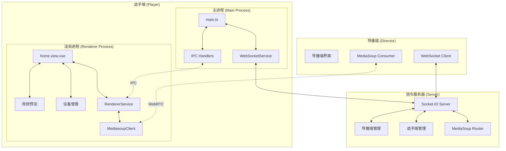
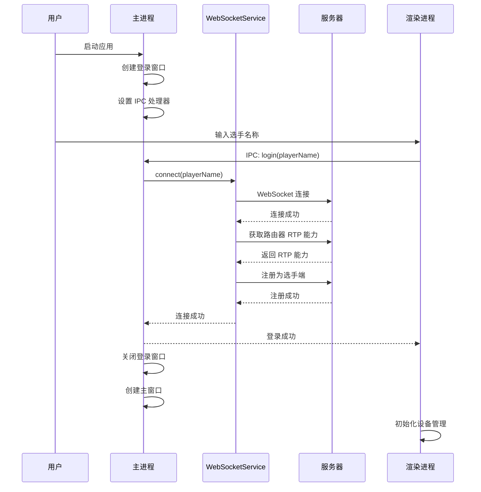
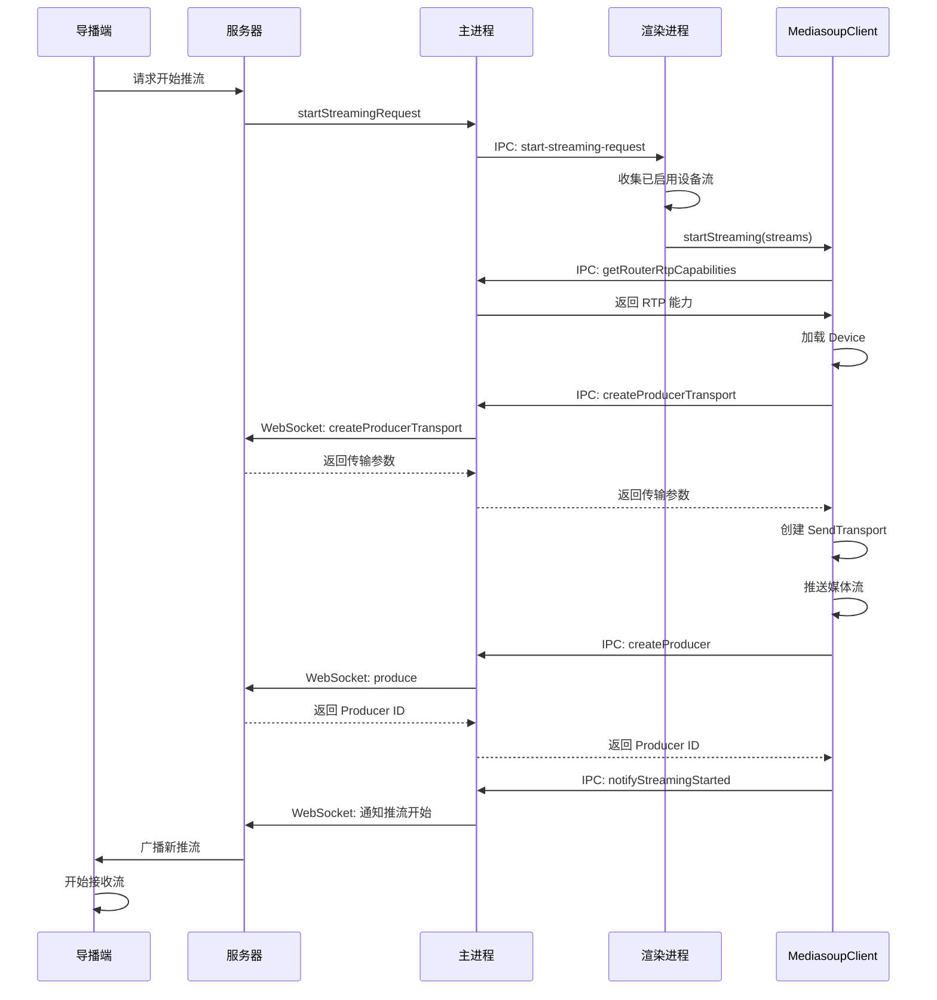
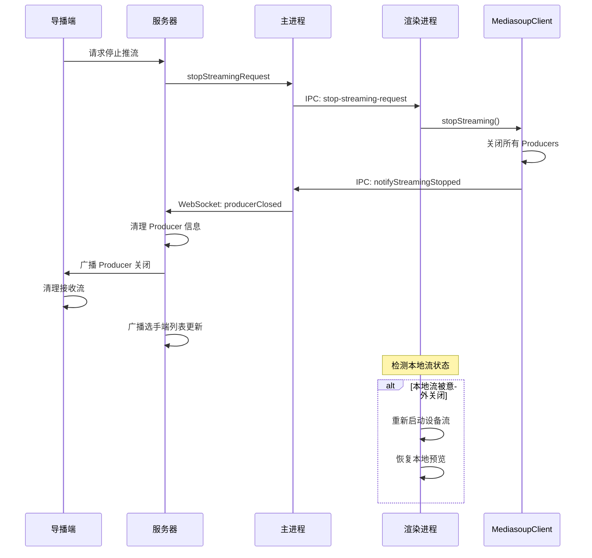
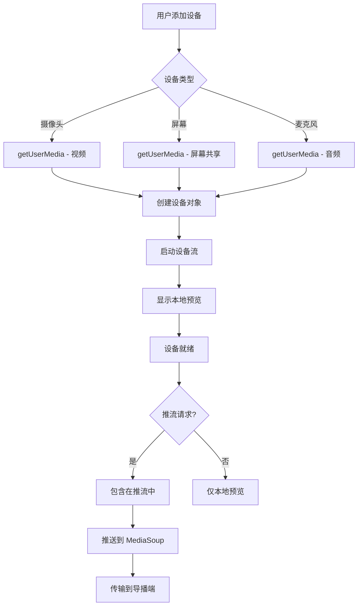

# Kessoku-the-Broadcaster 系统架构流程图

## 整体架构概览

```mermaid
graph TB
    subgraph "导播端 (Director)"
        D1[导播端界面]
        D2[MediaSoup Consumer]
        D3[WebSocket Client]
    end

    subgraph "信令服务器 (Server)"
        S1[Socket.IO Server]
        S2[MediaSoup Router]
        S3[选手端管理]
        S4[导播端管理]
    end

    subgraph "选手端 (Player)"
        subgraph "主进程 (Main Process)"
            M1[main.ts]
            M2[WebSocketService]
            M3[IPC Handlers]
        end

        subgraph "渲染进程 (Renderer Process)"
            R1[home.view.vue]
            R2[RendererService]
            R3[MediasoupClient]
            R4[设备管理]
            R5[视频预览]
        end
    end

    %% 连接关系
    D3 <--> S1
    M2 <--> S1
    S1 <--> S2
    S1 <--> S3
    S1 <--> S4

    M1 <--> M2
    M1 <--> M3
    M3 <-.IPC.-> R2
    R1 <--> R2
    R2 <--> R3
    R1 <--> R4
    R1 <--> R5

    %% WebRTC 连接
    D2 <-.WebRTC.-> R3
```

## 启动流程

```mermaid
sequenceDiagram
    participant U as 用户
    participant M as 主进程
    participant WS as WebSocketService
    participant S as 服务器
    participant R as 渲染进程

    U->>M: 启动应用
    M->>M: 创建登录窗口
    M->>M: 设置 IPC 处理器
    U->>R: 输入选手名称
    R->>M: IPC: login(playerName)
    M->>WS: connect(playerName)
    WS->>S: WebSocket 连接
    S-->>WS: 连接成功
    WS->>S: 获取路由器 RTP 能力
    S-->>WS: 返回 RTP 能力
    WS->>S: 注册为选手端
    S-->>WS: 注册成功
    WS-->>M: 连接成功
    M-->>R: 登录成功
    M->>M: 关闭登录窗口
    M->>M: 创建主窗口
    R->>R: 初始化设备管理
```

## 推流请求流程

```mermaid
sequenceDiagram
    participant D as 导播端
    participant S as 服务器
    participant M as 主进程
    participant R as 渲染进程
    participant MC as MediasoupClient

    D->>S: 请求开始推流
    S->>M: startStreamingRequest
    M->>R: IPC: start-streaming-request
    R->>R: 收集已启用设备流
    R->>MC: startStreaming(streams)
    MC->>M: IPC: getRouterRtpCapabilities
    M->>MC: 返回 RTP 能力
    MC->>MC: 加载 Device
    MC->>M: IPC: createProducerTransport
    M->>S: WebSocket: createProducerTransport
    S-->>M: 返回传输参数
    M-->>MC: 返回传输参数
    MC->>MC: 创建 SendTransport
    MC->>MC: 推送媒体流
    MC->>M: IPC: createProducer
    M->>S: WebSocket: produce
    S-->>M: 返回 Producer ID
    M-->>MC: 返回 Producer ID
    MC->>M: IPC: notifyStreamingStarted
    M->>S: WebSocket: 通知推流开始
    S->>D: 广播新推流
    D->>D: 开始接收流
```

## 停止推流流程

```mermaid
sequenceDiagram
    participant D as 导播端
    participant S as 服务器
    participant M as 主进程
    participant R as 渲染进程
    participant MC as MediasoupClient

    D->>S: 请求停止推流
    S->>M: stopStreamingRequest
    M->>R: IPC: stop-streaming-request
    R->>MC: stopStreaming()
    MC->>MC: 关闭所有 Producers
    MC->>M: IPC: notifyStreamingStopped
    M->>S: WebSocket: producerClosed
    S->>S: 清理 Producer 信息
    S->>D: 广播 Producer 关闭
    D->>D: 清理接收流
    S->>S: 广播选手端列表更新

    Note over R: 检测本地流状态
    alt 本地流被意外关闭
        R->>R: 重新启动设备流
        R->>R: 恢复本地预览
    end
```

## 🔧 设备管理流程

```mermaid
flowchart TD
    A[用户添加设备] --> B{设备类型}
    B -->|摄像头| C[getUserMedia - 视频]
    B -->|屏幕| D[getUserMedia - 屏幕共享]
    B -->|麦克风| E[getUserMedia - 音频]

    C --> F[创建设备对象]
    D --> F
    E --> F

    F --> G[启动设备流]
    G --> H[显示本地预览]
    H --> I[设备就绪]

    I --> J{推流请求?}
    J -->|是| K[包含在推流中]
    J -->|否| L[仅本地预览]

    K --> M[推送到 MediaSoup]
    M --> N[传输到导播端]
```